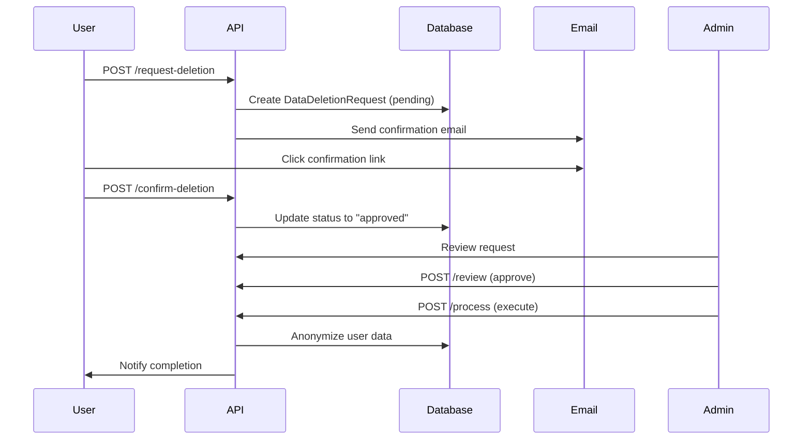
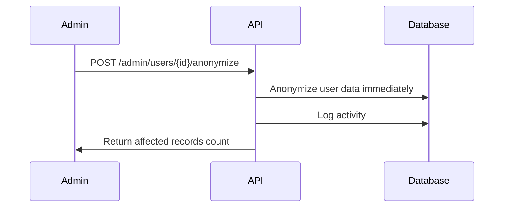

# GDPR-Compliant Data Privacy System

This module implements GDPR-compliant user data deletion and anonymization features.

## Features

### 🔒 **User Rights (GDPR Compliance)**

1. **Right to Data Portability (Article 20)**
   - Export all personal data in JSON format
   - Download comprehensive data package

2. **Right to Erasure / "Right to be Forgotten" (Article 17)**
   - Request account deletion
   - 30-day grace period (configurable)
   - Email confirmation required
   - Soft delete (anonymization) or hard delete options

### 📊 **Data Anonymization**

The system supports two types of deletion:

#### **Soft Delete (Recommended)**
- Replaces personal information with anonymized values
- Maintains historical records for business/legal requirements
- Anonymizes data across all tables:
  - AspNetUsers
  - Customers / Drivers
  - Jobs (customer/driver details)
  - Reviews
  - Payments
  - Support Tickets
  - Chat Messages
  - Complaints
  - Notifications
  - Activity Logs
  - And more...

#### **Hard Delete**
- Completely removes user data
- Use only when legally required
- Cannot be undone

### 🎯 **Endpoints**

#### **User Self-Service**

```http
# Export my data
GET /api/data-privacy/export

# View my data summary
GET /api/data-privacy/my-data-summary

# Request account deletion
POST /api/data-privacy/request-deletion
{
  "reason": "I no longer need this account",
  "deletionType": "soft",
  "requestDataExport": true,
  "gracePeriodDays": 30
}

# View my deletion requests
GET /api/data-privacy/my-deletion-requests

# Confirm deletion (after receiving email)
POST /api/data-privacy/confirm-deletion/{requestId}
{
  "confirmationToken": "abc123..."
}

# Cancel deletion request
POST /api/data-privacy/cancel-deletion/{requestId}
```

#### **Admin Endpoints**

```http
# Get all deletion requests
GET /api/data-privacy/admin/deletion-requests?status=pending

# Review and approve/reject request
POST /api/data-privacy/admin/deletion-requests/{id}/review
{
  "decision": "approve",
  "notes": "Request approved",
  "scheduledDeletionDate": "2024-12-01T00:00:00Z"
}

# Process (execute) deletion
POST /api/data-privacy/admin/deletion-requests/{id}/process

# Directly anonymize user (emergency use)
POST /api/data-privacy/admin/users/{userId}/anonymize

# Export user data
GET /api/data-privacy/admin/users/{userId}/export

# Get user data summary
GET /api/data-privacy/admin/users/{userId}/data-summary
```

## Setup

### 1. Register Service

Add to `Program.cs`:

```csharp
// Register Data Privacy services
builder.Services.AddScoped<IDataAnonymizationService, DataAnonymizationService>();
```

### 2. Run Migration

```bash
dotnet ef migrations add AddDataPrivacyFeatures
dotnet ef database update
```

### 3. Configure Email Notifications (Optional)

When a user requests deletion, send them a confirmation email with the `confirmationToken`.

## Workflow

### User-Initiated Deletion



### Admin-Initiated Deletion



## Data Anonymization Process

When anonymizing a user:

1. **Generate Anonymous ID**: `deleted-user-abc123`
2. **Update User Record**:
   - Email: `deleted-user-abc123@anonymized.local`
   - Username: `deleted-user-abc123@anonymized.local`
   - Phone: `null`
   - DisplayName: `[Deleted User abc123]`
   - IsDeleted: `true`
   - DeletedAt: `DateTime.UtcNow`

3. **Anonymize Related Data**:
   - Customer/Driver profiles
   - Job details (pickup/delivery addresses removed)
   - Review names/emails
   - Payment billing details
   - Support ticket personal info
   - Chat messages
   - Complaints
   - Activity logs

4. **Delete Sensitive Data**:
   - Driver documents
   - Saved addresses
   - Favorite drivers

5. **Preserve Business Data**:
   - Job records (anonymized)
   - Payment transactions (anonymized)
   - Reviews (anonymized)

## Security Considerations

- ⚠️ **SuperAdmin Protection**: SuperAdmin accounts cannot be deleted
- ⚠️ **Self-Deletion Disabled in UserService**: Users cannot delete their own accounts via the old endpoint
- ✅ **Confirmation Required**: Email confirmation prevents accidental deletions
- ✅ **Grace Period**: 30-day default grace period (configurable)
- ✅ **Audit Trail**: All actions logged in ActivityLog
- ✅ **Role-Based Access**: Admin endpoints require Admin/SuperAdmin role

## Legal Compliance

This implementation helps comply with:

- **GDPR (EU)**: Articles 17 (Right to Erasure) & 20 (Right to Data Portability)
- **CCPA (California)**: Right to deletion
- **UK DPA 2018**: Right to erasure
- **Other privacy regulations**: General best practices

## Testing

```bash
# Test user data export
curl -X GET https://your-api/api/data-privacy/export \
  -H "Authorization: Bearer {token}"

# Test deletion request
curl -X POST https://your-api/api/data-privacy/request-deletion \
  -H "Authorization: Bearer {token}" \
  -H "Content-Type: application/json" \
  -d '{
    "reason": "Testing deletion",
    "deletionType": "soft",
    "requestDataExport": true
  }'

# Admin: Process deletion
curl -X POST https://your-api/api/data-privacy/admin/deletion-requests/{id}/process \
  -H "Authorization: Bearer {admin-token}"
```

## Next Steps

1. **Email Integration**: Set up confirmation emails for deletion requests
2. **File Storage**: Store exported data files in blob storage
3. **Scheduled Jobs**: Auto-process approved deletions past grace period
4. **Compliance Reports**: Generate GDPR compliance reports
5. **User Communication**: Notify users when deletion is complete

## Support

For questions or issues, contact your system administrator.
